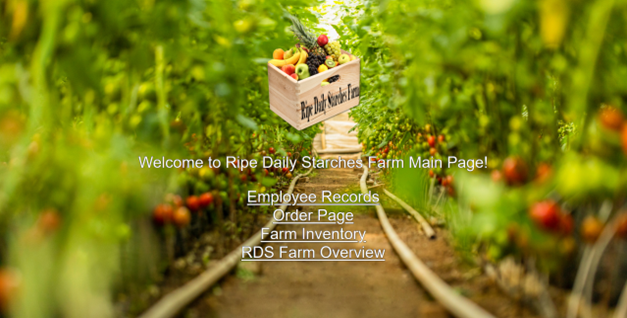
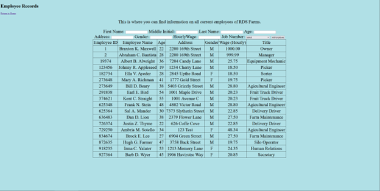
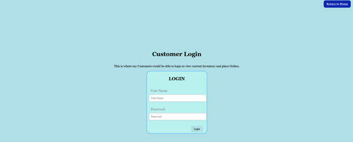
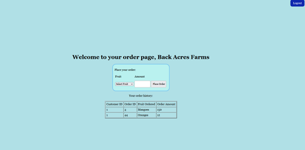
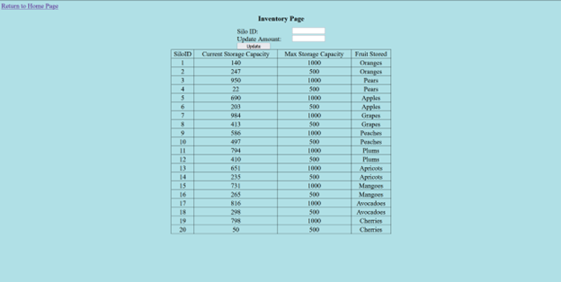
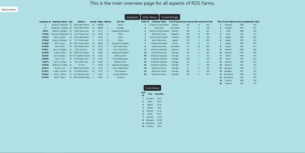

# Ripe Daily Starches Farm Server

This was a fake farm created to present our knowledge designing and creating a database system that was learned during my CS442 Database 
System 2022 semester. The purpose of this farm was to showcase a few different database tables using different restraints that work together in allowing things
such as:
- Adding employee's and showing their position/pay/person info
- Allowing a "customer" to login using a provided username/password that displays past order history and allow them to place another order to their store
- An administrator's page that shows the current inventory in the Silo's on the farm
- An overall page that displays all of the above in some tables

The technologies used in this project are as follows:

- Amazon AWS Services
  - EC2 to have remote access to page
  - RDS that remotely ran the main database this project ran on
- Apache HTTP Server
- MariaDB as my relation database choice

and languages used:

- HTML
- CSS
- PHP
- SQL

Before this, I had no experience working using front-end languages such as HTML/CSS or directly speaking with a backend using PHP. This was also
my first time using any AWS services as a remote server and learning how to set it up and commuicate with it had some growing pains, but I came out 
enjoying the experience of learning everything involved!

Things needed to be improved on:
- Better organization of my HTML/CSS stylings, learning on the fly lead to some sloppily placed and repeated code that could have been fixed up
- Learning and cleaning the syntax and implementation of PHP better, although it was very similar to Javascript, in my opinion, I found it very confusing 
on how and when to include PHP segments and add HTML such as adding information to tables, such as in EmployeeData.php
- Adding code to create certain tables if they could not be found in the database

As it is at the moment, you will be able to see nothing past the index page because I removed the AWS RDS database information for the server to be connected with for obvious reasons, and in the future will need to add query's to create table to whatever database the user does connect to if it cannot find the necessary tables to input data.

Here are some images of how it looked when presented in a working state:

- Index/Home page

- Employee Data

- Customer login

- Session created after customer logins display order history and allowing them to place another order

- Inventory, showing current amount of fruit in each silo and what fruit the silo contains

- Overview of all the different components above

Thanks for looking!
